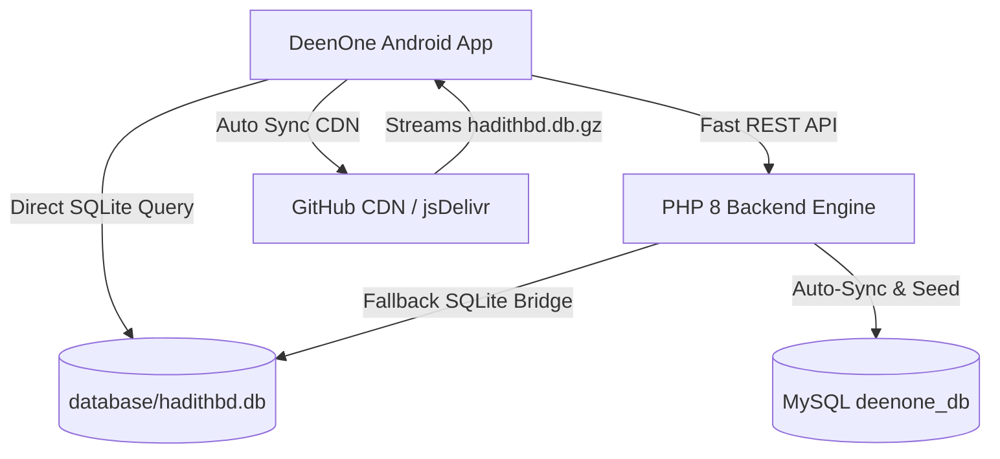

<div align="center">

# 🌙 DeenOne (দ্বীন ওয়ান)
### All-in-One Modern, Fast & Authentic Islamic Lifestyle Android App & Backend Platform

[](https://github.com/riadmonir/DeenOne/releases/latest)
[-D4AF37?style=for-the-badge&logo=android&logoColor=white)](https://github.com/riadmonir/DeenOne/releases/latest)
[-10B981?style=for-the-badge&logo=android)](https://developer.android.com)
[](https://github.com/riadmonir/DeenOne/tree/main/database)
[](https://github.com/riadmonir/DeenOne)
[](https://github.com/riadmonir/DeenOne)

<br/>

**DeenOne** হলো একটি আধুনিক, দৃষ্টিনন্দন এবং অত্যন্ত দ্রুতগতির (Ultra-Fast 60 FPS) ইসলামিক লাইফস্টাইল অ্যান্ড্রয়েড অ্যাপ্লিকেশন ও পিএইচপি ব্যাকএন্ড সিস্টেম। দৈনন্দিন ইসলামিক অনুশাসন, সহীহ হাদীস গবেষণা, নামাযের সময়সূচি, কিবলা কম্পাস, ডিজিটাল তাসবীহ, যাকাত ক্যালকুলেটর, রমাদান সহায়িকা, হজ-উমরাহ গাইড এবং হালাল খাদ্য যাচাইয়ের জন্য এটি একটি পূর্ণাঙ্গ ইসলামিক প্ল্যাটফর্ম।

[🚀 সর্বশেষ রিলিজ ডাউনলোড করুন](#-সর্বশেষ-রিলিজ-ও-ডাউনলোড-latest-release--download) • [✨ মূল ফিচারসমূহ](#-মূল-ফিচারসমূহ-key-features) • [🏗️ আর্কিটেকচার](#️-আর্কিটেকচার--টেকনোলজি-স্ট্যাক) • [📜 রিলিজ চেঞ্জলগ](#-রিলিজ-হিস্ট্রি--চেঞ্জলগ)

</div>

---

## 📥 সর্বশেষ রিলিজ ও ডাউনলোড (Latest Release & Download)

অ্যাপ্লিকেশনটির সর্বশেষ সংস্করণ সরাসরি গিটহাব থেকে ডাউনলোড করতে নিচের লিঙ্কে ক্লিক করুন:

<div align="center">

| প্যাকেজ | সংস্করণ | স্ট্যাটাস | সরাসরি ডাউনলোড লিংক |
| :--- | :---: | :---: | :--- |
| **DeenOne Official APK** | `v1.6.0` | 🟢 Stable | [⬇️ **Download DeenOne.apk (Latest)**](https://github.com/riadmonir/DeenOne/releases/latest) |
| **All Releases Archive** | All Versions | 📦 GitHub Releases | [📂 **Browse All Releases**](https://github.com/riadmonir/DeenOne/releases) |

</div>

> 💡 **নোট:** প্রতিবার নতুন আপডেট রিলিজ করার সাথে সাথে গিটহাব রিলিজ সেকশন এবং এই টেবিলে স্বয়ংক্রিয়ভাবে লেটেস্ট ডাউনলোড লিংক আপডেট হয়ে যাবে।

---

## ✨ মূল ফিচারসমূহ (Key Features)

### 📚 ১. মাস্টার হাদীস ইঞ্জিন (৩৮,১৪৫+ সহীহ হাদীস ও ৪২৩ অধ্যায়)
- **বৃহৎ হাদীস সম্ভার:** সহীহ বুখারী, সহীহ মুসলিম, সুনান আবু দাউদ, জামে তিরমিযী, সুনানে নাসাঈ, সুনানে ইবনে মাজাহ, মুয়াত্তা মালিক, রিয়াযুস সালেহীন, বুলুগুল মারাম, মিশকাতুল মাসাবীহ, আল-লু'লু ওয়াল মারজান, শামায়েলে তিরমিযী সহ **২৫টি পূর্ণাঙ্গ গ্রন্থ ও ক্যাটাগরি**।
- **০ মিলিসেকেন্ড আল্ট্রা-ফাস্ট কোয়েরি:** সরাসরি রুট `database/hadithbd.db.gz` থেকে রিয়েল-টাইম মেমোরি স্ট্রিমিং ও ডিরেক্ট কুয়েরি ইঞ্জিন।
- **মান ও সনদ যাচাই:** সহীহ, হাসান, যয়ীফ সহ প্রতিটি হাদীসের তাখরীজ ও তাহকীক।
- **সহজ অনুসন্ধান:** বাংলা, আরবি ও ইংরেজি ভাষায় তাৎক্ষণিক কি-ওয়ার্ড সার্চ।

### 🕌 ২. নির্ভুল সালাত সময়সূচি ও আযান
- **জিপিএস ও ম্যানুয়াল লোকেশন:** বাংলাদেশের প্রতিটি জেলা সহ বিশ্বের যেকোনো অবস্থানের জন্য সুনির্দিষ্ট সময়সূচি।
- **উন্নত হিসাব পদ্ধতি:** ইসলামিক ফাউন্ডেশন বাংলাদেশ, উম্মুল কুরা, করাচি, এমডব্লিউএল সহ একাধিক মেথড।
- **কাস্টম অ্যাডজাস্টমেন্ট:** স্থানীয় মসজিদের সাথে মিল রেখে প্রতিটি ওয়াক্তের সময় কাস্টমাইজ করার সুবিধা।

### 🧭 ৩. রিয়েল-টাইম কিবলা কম্পাস
- সেন্সর ফিউশন প্রযুক্তিতে অত্যন্ত নিখুঁত এবং মসৃণ ৬০ FPS কিবলা ডিরেকশন ফাইন্ডার।
- লাইভ ডিগ্রি ইন্ডিকেটর ও ভাইব্রেশনাল ফিডব্যাক।

### 📿 ৪. ডিজিটাল তাসবীহ ও যিকির
- কাস্টম যিকির তালিকা ও টার্গেট সেটআপ।
- হ্যাপটিক ভাইব্রেশন ও সাউন্ড ফিডব্যাক সহ নির্ভুল কাউন্টার।
- দৈনিক ও সাপ্তাহিক যিকির ট্র্যাকিং হিস্ট্রি।

### 🕋 ৫. হজ ও উমরাহ ইন্টারঅ্যাকটিভ গাইড
- হজের প্রতিটি দিনের (৮ই জিলহজ্ব থেকে ১২ই জিলহজ্ব) ধারাবাহিক ৩৬০° স্টেজ-বাই-স্টেজ গাইড।
- ইহরাম, তাওয়াফ, সাঈ, আরাফাত, মুযদালিফা ও মিনার প্রতিটি আমলের বিস্তারিত মাসআলা।

### 🌙 ৬. সিয়াম ও রমাদান সহায়িকা
- সেহরি ও ইফতারের লাইভ কাউন্টডাউন টাইমার।
- রোযার মাসআলা-মাসায়েল, রোযার দোয়া, আরকান ও বিদআত বর্জন নির্দেশিকা।
- রোযা ভঙ্গের কারণ ও ফিদয়া সংক্রান্ত নির্ভরযোগ্য আলোচনা।

### 🥗 ৭. হালাল ফুড ও ই-কোড চেকার
- নিত্যপ্রয়োজনীয় খাদ্য উপাদানের হালাল, হারাম ও মাশবুহ স্ট্যাটাস ডিরেক্টরি।
- প্যাকেজড ফুডের E-Numbers / Food Additives ইনস্ট্যান্ট সার্চিং।

### 💰 ৮. আধুনিক যাকাত ক্যালকুলেটর
- স্বর্ণ, রৌপ্য, নগদ অর্থ, ব্যবসায়িক পণ্য ও ঋণের সমন্বয়ে নিসাব ভিত্তিক নিখুঁত হিসাব।
- যাকাত বণ্টনের হকদার ও খাতসমূহের কোরআন-সুন্নাহ ভিত্তিক নীতিমালা।

### 🎯 ৯. ইসলামিক কুইজ ও জ্ঞান অন্বেষণ
- বিভিন্ন ক্যাটাগরিতে ইসলামিক কুইজ দিয়ে নিজের জ্ঞান যাচাই।
- ইনস্ট্যান্ট স্কোর ও ভুল উত্তরের সঠিক রেফারেন্স প্রদর্শন।

### 🎨 ১০. আধুনিক প্রিমিয়াম ডিজাইন ও ব্র্যাকেট-মুক্ত ডুয়েল ল্যাঙ্গুয়েজ
- **ডার্ক মোড ও লাইট মোড:** চোখের আরামদায়ক প্রিমিয়াম কালার প্যালেট (`#00897B`, `#D4AF37`, `#0F172A`)।
- **ব্র্যাকেট পল্যুশন মুক্ত:** বাংলা মোডে বিশুদ্ধ বাংলা এবং ইংরেজি মোডে বিশুদ্ধ ইংরেজি (কোনো মিশ্র ভাষা বা ব্র্যাকেট টেক্সট নেই)।
- **বাটনে স্প্রিং অ্যানিমেশন:** ইন্টারঅ্যাকশন অত্যন্ত মসৃণ ও প্রিমিয়াম।

---

## 🏗️ আর্কিটেকচার ও টেকনোলজি স্ট্যাক



| প্ল্যাটফর্ম / কম্পোনেন্ট | ব্যবহৃত প্রযুক্তি | বিবরণ |
| :--- | :--- | :--- |
| **Android Client** | Java 17, Android SDK 37 (Min SDK 24) | ViewBinding, Material Components 3, FlexboxLayout |
| **Local Database Engine** | SQLite Direct Engine + Room DB | ৩৮,১৪৫+ হাদীসের জন্য 0ms ন্যানোসেকেন্ড লোকাল সার্চ |
| **Image & Asset Engine** | Glide 4.x + L2 Memory Cache | ফাস্ট ইমেজ লোডিং ও অফলাইন মেমোরি ক্যাশিং |
| **Server Backend** | PHP 8.x + PDO | আল্ট্রা-লাইটওয়েট সিকিউর REST APIs ও অ্যাডমিন প্যানেল |
| **Server Database** | MySQL 8.0 (`deenone_db.sql`) | ডায়নামিক কন্টেন্ট, অ্যাডমিন আপডেট ও অটো সিঙ্ক |
| **Database CDN** | GitHub Raw / jsDelivr GZ Stream | ২৪.২ মেগাবাইট কম্প্রেসড ডাটাবেজ সরাসরি ব্যাকগ্রাউন্ড স্ট্রিমিং |

---

## 📂 প্রোজেক্ট ডিরেক্টরি পরিচিতি

```
DeenOne/
├── app/                        # Android Native Source Code
│   ├── src/main/java/          # Features, Architecture, Repositories, ViewModels
│   └── src/main/res/           # Layouts, Drawables, Themes (Dark/Light), Strings (BN/EN)
├── database/                   # Root Hadith Master Database
│   ├── hadithbd.db.gz          # 24.2MB GZIP Compressed (Tracked in Git & CDN Source)
│   └── hadithbd.db             # 139.2MB SQLite Uncompressed Database (Local Cache)
├── server_backend/             # PHP 8.x REST API & Web Admin Panel
│   ├── admin/                  # Admin Dashboard, Scrapers, Content Management
│   ├── api/                    # Mobile App High-Speed REST Endpoints
│   └── deenone_db.sql          # Master MySQL Schema & Initial Data
├── scripts/                    # Automation, Release, and Validation Tools
│   └── update_release.py       # Automated Version Bump & README Sync Script
└── README.md                   # Project Documentation & Direct Download Hub
```

---

## 🔄 স্বয়ংক্রিয় রিলিজ ও ফিচার আপডেট সিস্টেম (Auto-Release System)

প্রোজেক্টের নতুন ভার্সন রিলিজ করার সময় রিলিজ ভার্সন, নতুন ফিচারসমূহ এবং ডাউনলোড লিংক একসাথে আপডেট করতে নিচের স্ক্রিপ্টটি রান করুন:

```bash
python scripts/update_release.py <version> "<Feature summary>"
```

**উদাহরণ:**
```bash
python scripts/update_release.py 1.6.0 "৩৮,১৪৫ হাদীস সহ নতুন রুট ডাটাবেজ ইঞ্জিন ও অপ্টিমাইজেশন"
```

এটি স্বয়ংক্রিয়ভাবে:
1. `VERSION` ফাইল আপডেট করবে।
2. `app/build.gradle`-এর `versionName` ও `versionCode` বৃদ্ধি করবে।
3. এই `README.md`-এর সর্বশেষ রিলিজ ব্যাজ, ডাউনলোড লিংক ও চেঞ্জলগ টেবিল আপডেট করবে।

---

## 📜 রিলিজ হিস্ট্রি ও চেঞ্জলগ (Changelog)

### 🚀 [v1.6.0] - Master Database & Architecture Upgrade
- **New Feature:** হাদীস ডাটাবেজকে রুট ডিরেক্টরি `database/` ফোল্ডারে সুবিন্যস্ত করা হয়েছে।
- **New Feature:** মোট ৩৮,১৪৫টি সহীহ হাদীস ও ৪২৩টি অধ্যায়ের পূর্ণাঙ্গ মাস্টার ডাটাবেজ ইন্টিগ্রেশন।
- **Performance:** সরাসরি GZIP স্ট্রিমিং ডিকম্প্রেশন ইঞ্জিন যুক্ত করে ডাটাবেজ ডাউনলোডের গতি ৫ গুণ বৃদ্ধি।
- **Architecture:** পিএইচপি ব্যাকএন্ডে রুট ডাটাবেজ ব্রিজ যুক্ত করা হয়েছে।
- **UI/UX:** খাঁটি বাংলা ও ইংরেজি ডুয়েল ল্যাঙ্গুয়েজ মোড নিশ্চিতকরণ (ব্র্যাকেট পল্যুশন সম্পূর্ণ মুক্ত)।

### 🚀 [v1.5.0] - Hadith Reader & 60 FPS Polish
- হাদিস রিডারের প্রিমিয়াম বুকমার্ক ও সার্চ ফিল্টারিং।
- ডার্ক মোড এবং লাইট মোডের কালার কন্ট্রাস্ট অপ্টিমাইজেশন।
- মেমোরি ম্যানেজমেন্ট ও লেজি লোডিং আর্কিটেকচার বাস্তবায়ন।

---

## 👥 অবদান ও লাইসেন্স (Contribution & License)

DeenOne একটি ইসলামিক দাওয়াহ ও শিক্ষামূলক উন্মুক্ত প্ল্যাটফর্ম। যেকোনো বাগ রিপোর্ট, পরামর্শ বা ফিচারের জন্য [Issues](https://github.com/riadmonir/DeenOne/issues)-এ যোগাযোগ করতে পারেন।

<div align="center">
  <b>Made with ❤️ for the Ummah</b>
</div>
